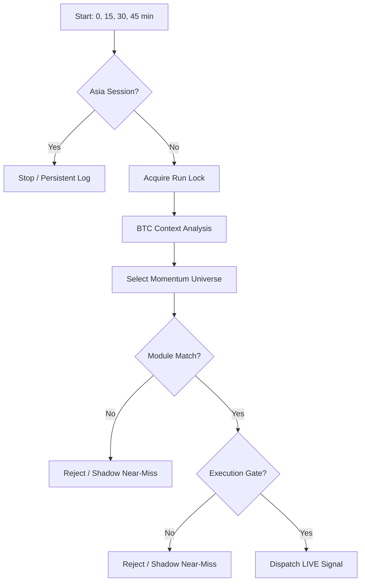

# Documentación del Algoritmo de Trading (v13.2.0 / v3.2.0)

Esta documentación sirve como guía técnica para entender, mantener y optimizar el sistema de señales de trading de contado (Spot-Only) alojado en Netlify Functions.

> ⚠️ **Regla de mantenimiento:** Cualquier cambio en `trader-bot.js` debe reflejarse en este documento Y en `ALGORITHM_JOURNAL.md` antes de considerarse completo.

> ℹ️ **Nota de la V10:** Desde `v10.0.0-QuantumEdge`, hemos abandonado el "score soup" (mezcla de indicadores para un puntaje arbitrario) a favor de un sistema de **Módulos de Estrategia Puros**. Un trade solo existe si cumple los requisitos deterministas de un módulo institucional.

---

## Current Runtime Snapshot (Trader v14 / Knife v4 — wrappers en producción)

> **Cambio operativo 2026-05-23:** Los bots live ahora son los wrappers [`trader-bot-v14.js`](netlify/functions/trader-bot-v14.js) y [`knife-catcher-v4.js`](netlify/functions/knife-catcher-v4.js), que aplican filtros de calidad de entrada **encima** de la lógica v13/v3. Los originales `trader-bot.js` y `knife-catcher.js` están **intactos pero con su cron desactivado** — son importados por los wrappers vía `runAnalysis(context, { signalFilter })`. Ver [AUDIT_BOTS_2026-05.md §7](AUDIT_BOTS_2026-05.md) para la justificación y métricas validadas.

### Resumen
- **Runtime Versions (live):** `v14.0.0-EntryQualityFilters` (Trader) / `v4.0.0-OversoldReclaim` (Knife)
- **Runtime Versions (core, sin cron):** `v13.2.0-ExecutionFlowHardening` / `v3.2.0-ReversalShadowHardening`
- **File Core:** `trader-bot-v14.js` → wraps `trader-bot.js`; `knife-catcher-v4.js` → wraps `knife-catcher.js`
- **Estilo Bot 1 (TradingView Fusion):** `spot`, `long-only`, trend/reclaim scanner.
- **Estilo Bot 2 (Reversal Lab):** `spot`, `long-only`, confirmed reversal scanner.
- **Filosofía:** módulos de estrategia separados, derivados de los indicadores en `tradinview-indicators`, con historial/cooldowns/shadow trading preservados en Netlify Blobs.

### Filtros v14/v4 aplicados post-`generateSignal`

**Trader v14** ([trader-bot-v14.js](netlify/functions/trader-bot-v14.js)) — los 5 filtros se aplican en cadena, una señal debe pasar todos para ser live:
1. **`htfMomentumRising`** — MACD histogram 1h ascendiendo ≥2 barras consecutivas.
2. **`recent15mBullish`** — ≥2 de las últimas 3 velas 15m con cierre alcista.
3. **`pullbackReclaimedEma9`** — alguna vela de las últimas 5 tocó EMA9 + close actual reclama.
4. **Module exclude** — `TWO_POLE_PULLBACK_CONTINUATION` rechazado (PF 0.53 aislado).
5. **`min RS 1h ≥ 0.003`** — Relative Strength positiva real en 1h.

**Knife v4** ([knife-catcher-v4.js](netlify/functions/knife-catcher-v4.js)):
1. **Module restrict a `VIDYA_LIQUIDITY_SWEEP`** — los otros 2 módulos disparan ~2-4 veces/mes; muertos en la práctica.
2. **`rsiOversoldReclaim`** — RSI 5m dipped <30 en últimas 8 velas, ahora >38, close actual > el mínimo del dip.
3. **`shadowOnly: false` override** — las señales que pasan los filtros se promueven a LIVE (el bot las marca shadowOnly por defecto).

**Métricas validadas (3 meses OOS, top-5 USDT):**
| | Baseline | v14/v4 |
|---|---|---|
| Trader WR | ~30% | **35-39%** |
| Trader PF | 1.05 | **1.67-1.75** |
| Knife WR | ~29% | **38.1%** |
| Knife PF | 1.02 | **2.00** |

### Arquitectura de Módulos Activa

#### Bot 1: TradingView Fusion (`trader-bot.js`)
- **`VIDYA_SQUEEZE_EXPANSION`**
  - **Lógica:** Volumatic VIDYA en tendencia alcista + Squeeze Momentum alcista + MACD confirmado.
  - **Uso:** captura expansiones de tendencia tras compresión o aceleración limpia.
- **`SMC_DISCOUNT_RECLAIM`**
  - **Lógica:** estructura SMC alcista reciente + reclaim de EMA/VWAP u order block.
  - **Uso:** entradas de continuación tras pullback a zona de valor.
- **`TWO_POLE_PULLBACK_CONTINUATION`**
  - **Lógica:** reset del oscilador Two-Pole dentro de tendencia 1H compatible por SOTT/MLMA.
  - **Uso:** pullbacks controlados, evitando persecución de velas extendidas.
- **Módulos experimentales shadow-only:** `QUANTUM_REVERSION`, `VELOCITY_BREAKOUT` y `MACD_DIVERGENCE_REVERSAL` pueden generar shadow candidates, pero no señales live.
- **Order-flow hardening v13.2:** después del execution gate, una señal live se bloquea con `ORDERFLOW_ASK_HEAVY` si `obi < -0.30`, o con `ORDERFLOW_WEAK_BUY_PRESSURE` si `deltaRatio < -0.05` sin OBI favorable. El objetivo es reducir pérdidas de 0% MFE sin relajar ningún gate.

#### Bot 2: Reversal Lab (`knife-catcher.js`)
- **`TWO_POLE_CAPITULATION_RESET`**
  - **Lógica:** impulso de capitulación + reset/buy cross de Two-Pole + volumen.
  - **Estado v3.2:** shadow-only hasta recuperar expectativa positiva en shadow archive.
- **`VIDYA_LIQUIDITY_SWEEP`**
  - **Lógica:** barrido de mínimo previo o reclaim SMC + VIDYA/MACD/Two-Pole confirmando giro.
  - **Estado v3.2:** shadow-only; requiere floor base 72, delta no negativo fuerte y VWAP distance <= 1.8%.
- **`SOTT_BAND_RECLAIM`**
  - **Lógica:** recuperación de banda inferior de Bollinger + cruce alcista SOTT + momentum girando.
  - **Estado v3.2:** shadow-only hasta tener muestra shadow resuelta suficiente.
- **Modo Shadow opcional:** `KNIFE_GLOBAL_SHADOW_MODE=true` fuerza Bot 2 a registrar señales como shadow sin enviarlas como live.
- **Exit Telemetry:** Bot 2 sigue persistiendo `exitPrice`, `exitReason` y `closedAt` para auditoría.

### Clasificación de Riesgo & Regímenes
- **`RISK_OFF`:** Bloqueo total si `BTC 4H` está bajista o BTC Status es `RED`.
- **`RANGING / VOLATILE_TRANSITION`:** Operativos con score mínimo más elevado, especialmente en Bot 2.
- **BTC Context (SEM):**
  - `RED`: Bloqueo total (Shadow Only).
  - `AMBER`: Requiere +4/+2 puntos extra de Score para entrar live.
  - `GREEN`: Operación normal.
- **Penalización de Régimen (v13/v3):**
  - Bot 1 sube el suelo en `RANGING` para expansiones VIDYA y en `VOLATILE_TRANSITION`.
  - Bot 2 sube el suelo en `TRENDING`, `HIGH_VOL_BREAKOUT` y `VOLATILE_TRANSITION` para evitar comprar reversión contra tendencias violentas.
- **Score Floors v13.2/v3.2:**
  - Bot 1 mantiene floor runtime base 65 con penalizaciones por liquidez/régimen/BTC; se endureció order-flow en vez de subir score global por muestra insuficiente.
  - Bot 2 restaura floor runtime base 72, pero sus módulos activos están en shadow-only por expectativa reciente negativa.
- **Execution Floors:** ambos bots bloquean por defecto spreads superiores a 8 bps y profundidad top-N inferior a `$90k` (`MAX_SPREAD_BPS`, `KNIFE_MAX_SPREAD_BPS`, `MIN_DEPTH_QUOTE`, `KNIFE_MIN_DEPTH_QUOTE` pueden sobreescribirlo por env si hace falta).

### Filtros de Liquidez (v10.1.0 Update)
- `ELITE` / `HIGH` → Live ✅
- `MEDIUM` + `VWAP_PULLBACK` → Live ✅ (score floor +3)
- `MEDIUM` + `VCP_BREAKOUT` → Shadow Only
- `LOW` + `depthQuoteTopN >= $200k` + `VWAP_PULLBACK` → Live ✅ (0.5x sizing, `promotedFromLow` flag)
- `LOW` (below depth floor) → Shadow / Reject

---

## 1. Arquitectura del Sistema

El bot opera como un ecosistema serverless interconectado:

- **Netlify Functions Paralelas:**
  - `trader-bot`: Bot 1 (TradingView Fusion). Corre en los minutos `0,15,30,45`.
  - `knife-catcher`: Bot 2 (Reversal Lab). Corre en los minutos `5,20,35,50` para evitar rate-limits de MEXC.
  - `auto-digest`: Genera el reporte diario a las **09:00 UTC**.
  - `telegram-bot`: Interfaz de comandos.
- **Netlify Blobs (Aislados):**
  - **Bot 1:** Usa llaves como `signal-history-v2`, `shadow-trades-v1`.
  - **Bot 2:** Usa llaves específicas como `knife-history-v1`, `knife-shadow-trades-v1`.

---

## 2. Sistema de Decisión (TradingView Fusion)

A diferencia de las versiones de confluencia genérica, cada señal nace de un módulo concreto. El score decide prioridad y tamaño, pero el módulo decide si existe un setup válido.

1. **Validación de Módulo:** ¿Cumple el asset los requisitos de uno de los módulos activos?
2. **Ranking:** Si varios módulos son válidos, se elige el de mayor Score.
3. **Execution Gate:** spread/profundidad/liquidez deben pasar antes de persistir una señal live.
4. **Shadow Tracking:** candidatos cercanos que fallen score, ejecución o sector se guardan como shadow para auditoría.
5. **Position Sizing:** el score, ATR, liquidez, régimen y fuerza relativa determinan `recommendedSize`.

---

## 3. Pipeline de Ejecución (trader-bot.js)

---

## 4. Gestión de Riesgo Adaptativa

| Módulo | SL Base | TP Base | Ratio R:R |
|--------|---------|---------|-----------|
| `VIDYA_SQUEEZE_EXPANSION` (Bot 1) | ~1.35x ATR / estructura | 2.3R | >=2.0:1 |
| `SMC_DISCOUNT_RECLAIM` (Bot 1) | ~1.2x ATR / swing low | 2.4R | >=2.0:1 |
| `TWO_POLE_PULLBACK_CONTINUATION` (Bot 1) | ~1.15x ATR | 2.05R | >=1.8:1 |
| `TWO_POLE_CAPITULATION_RESET` (Bot 2) | ~1.15x ATR / sweep low | 2.25R | >=1.8:1 |
| `VIDYA_LIQUIDITY_SWEEP` (Bot 2) | ~1.25x ATR / sweep low | 2.45R | >=1.8:1 |
| `SOTT_BAND_RECLAIM` (Bot 2) | ~1.1x ATR | 2.15R | >=1.8:1 |

- **Time Stop:** Cada módulo define sus horas de espera. Bot 1 usa ventanas aproximadas de 10h-16h; Bot 2 usa 5h-7h y reduce el tiempo en regímenes violentos.
- **ATR Dynamic:** Si el ATR % es alto, el tamaño de posición se reduce automáticamente. Bot 2 usa sizing más conservador por tratarse de reversión.
- **Break-Even Stop (Añadido en v11.0.0):** Cuando un trade en Bot 1 alcanza el 50% de la distancia hacia su Take Profit, el Stop Loss se mueve automáticamente a Break-Even + 0.1%.
- **Exit Telemetry (v11.1.2):** Si ese stop movido se ejecuta con el precio todavía por encima de la entrada, el cierre se clasifica como `BREAK_EVEN` con `exitReason=TRAIL_BE_STOP` en vez de `LOSS`. Si hay gap por debajo de la entrada, sigue contando como `LOSS`.
- **Regime Stops:** En `VOLATILE_TRANSITION` y `HIGH_VOL_BREAKOUT` se sube el score mínimo y Bot 2 acorta su time stop.

---

## 5. Changelog Reciente

### v14.0.0-EntryQualityFilters / v4.0.0-OversoldReclaim (23 May 2026)
- **Wrappers de producción**: `trader-bot-v14.js` y `knife-catcher-v4.js` son ahora los handlers scheduled. Importan `runAnalysis` del v13/v3 y aplican filtros post-`generateSignal` vía la opción `signalFilter`.
- **Trader v14 filtros encadenados**: htfMomentumRising (MACD 1h ascendiendo 2 barras), recent15mBullish, pullbackReclaimedEma9, exclude TWO_POLE, min RS 1h ≥ 0.003.
- **Knife v4 filtro crítico**: rsiOversoldReclaim (5m), restringido a `VIDYA_LIQUIDITY_SWEEP`, override de `shadowOnly: false` para activar señales live.
- **Cambio mínimo en originales**: `runAnalysis(context)` → `runAnalysis(context, options = {})` con hook post-signal de 16 líneas. 100% backward-compatible. Crons originales desactivados (los wrappers asumen sus offsets `0,15,30,45` y `5,20,35,50`).
- **Validación**: 3 meses OOS top-5 USDT. Trader v14 PF 1.75 (vs 1.05 baseline) WR 39.3%. Knife v4 PF 2.00 (vs 1.02) WR 38.1%. OOS holdout ambos veredicto "robusta" automático.
- **Rollback**: descomentar `import { schedule }` + `export const handler = schedule(...)` en cada original; borrar los wrappers.
- **Doc full**: [AUDIT_BOTS_2026-05.md §7](AUDIT_BOTS_2026-05.md).

### v13.2.0-ExecutionFlowHardening / v3.2.0-ReversalShadowHardening (15 May 2026)
- **Bot 1 Order-Flow Gate:** nuevo bloqueo live `ORDERFLOW_ASK_HEAVY` para `obi < -0.30` y `ORDERFLOW_WEAK_BUY_PRESSURE` para `deltaRatio < -0.05` sin OBI favorable.
- **Execution Gate Restored:** default spread máximo vuelve a 8 bps y profundidad mínima a `$90k` en ambos bots; `8.5 bps` debe rechazar con `EXEC_SPREAD` y depth `< $90k` con `EXEC_DEPTH`.
- **Bot 1 Experimental Modules Shadow-Only:** `QUANTUM_REVERSION`, `VELOCITY_BREAKOUT` y `MACD_DIVERGENCE_REVERSAL` se preservan como investigación, sin live alerts.
- **Bot 2 Shadow Quarantine:** `TWO_POLE_CAPITULATION_RESET`, `VIDYA_LIQUIDITY_SWEEP` y `SOTT_BAND_RECLAIM` quedan shadow-only hasta demostrar expectancy > +0.2R con n >= 30 resolved shadows.
- **Bot 2 Score Floor Restored:** `SIGNAL_SCORE_THRESHOLD` vuelve a 72 por defecto; `VIDYA_LIQUIDITY_SWEEP` deja de usar `baseRequiredScore: 5`.
- **VIDYA Sweep Hardening:** Bot 2 bloquea `VIDYA_SWEEP_OVEREXTENDED` sobre 1.8% de distancia VWAP y `VIDYA_NEGATIVE_DELTA` si `deltaRatio5m < -0.05`.

### v13.0.0-TradingViewFusion / v3.0.0-TradingViewReversalLab (1 May 2026)
- **Full Strategy Reset:** `trader-bot.js` y `knife-catcher.js` fueron reconstruidos desde cero usando traducciones JS de los indicadores en `tradinview-indicators`.
- **Bot 1:** nuevos módulos `VIDYA_SQUEEZE_EXPANSION`, `SMC_DISCOUNT_RECLAIM` y `TWO_POLE_PULLBACK_CONTINUATION`.
- **Bot 2:** nuevos módulos `TWO_POLE_CAPITULATION_RESET`, `VIDYA_LIQUIDITY_SWEEP` y `SOTT_BAND_RECLAIM`.
- **Persistence Preserved:** se mantienen claves de Netlify Blobs para history, cooldowns, shadows, archives, autopsies y persistent logs.
- **Telegram Preserved:** las alertas siguen usando el bot actual y el handler manual con `NOTIFY_SECRET` opcional.

### v12.0.1-QuantumSniper (30 Abr 2026)
- **P0 Remediation:** Elevado umbral de ejecución de 70 a **82** tras identificar expectativa negativa en scores bajos.
- **USDC Filter:** Eliminación del par `USDC/USDT` del universo analizable.
- **Telemetry WR:** Integración de Win Rate en tiempo real en las alertas de Telegram.

### v12.0.0-QuantumSniper (28 Abr 2026)
- **Quantum Sniper Overhaul:** Reconstrucción total del motor de decisión de Bot 1.
- **SMC Integration:** Implementación de Smart Money Concepts (BOS + Order Blocks) para alineación institucional.
- **ML Trend Analysis:** Incorporación de regresión ML (GPR) para detección de tendencia robusta.
- **Squeeze Momentum:** Detección de volatilidad comprimida vs expandida para "sniper entries".
- **Dynamic Risk Model:** Stop Loss basado en Swing Lows recientes en lugar de porcentajes fijos o ATR puro.
- **Score Confluence:** Umbral de ejecución elevado a 70/100 para máxima precisión.

### v2.2.0-KnifeCatcher-Quantum (28 Abr 2026)
- **P0 Audit Remediation:** Shadow-only para módulos `KNIFE_CATCHER`, `PIVOT_REVERSION` y `KELTNER_REVERSION` debido a expectativa negativa.
- **Regime Hardening:** Bloqueo total de operaciones en régimen `TRANSITION`.
- **STREAK_REVERSAL Priority:** Mantenido como único módulo live tras demostrar edge de +1.05R.

### v11.1.2-QuantumEdge (26 Abr 2026)
- **Trailing Break-Even Exit Classification:** Los stops movidos por `trailingStopActive` ya no pueden cerrar como `LOSS` si el precio de salida sigue `>= entry`. Ahora se registran como `BREAK_EVEN`.
- **Exit Telemetry Upgrade:** `history.json` y `autopsies.json` incluyen `exitPrice`, `exitReason`, `closedAt` y el estado explícito de `trailingStopActive` para auditoría forense fiable.

### v2.1.2-KnifeCatcher-Quantum (26 Abr 2026)
- **Exit Telemetry Upgrade:** `knife_history.json` y `knife_autopsies.json` ahora persisten `exitPrice`, `exitReason`, `closedAt` y `trailingStopActive=false` explícito en cada cierre.
- **No Strategy Geometry Change:** No se alteraron módulos, score floors ni risk models de Bot 2; el cambio es exclusivamente de observabilidad y forensics.

### v2.1.0-KnifeCatcher-Quantum (21 Abr 2026)
- **[H1] STREAK Volume Hard Gate:** `STREAK_REVERSAL` ahora requiere `volumeRatio >= 0.8x` como gate duro. Rechaza con `STREAK_LOW_VOL`. Auditoría reveló que 3/4 losses de STREAK tenían volumePass=false (ratios 0.33x–0.72x).
- **[H2] TRENDING Regime Penalty:** Módulos de mean reversion (`STREAK`, `PIVOT`, `KELTNER`) requieren +5 puntos extra en régimen `TRENDING`. Auditoría mostró WR TRENDING=33.3% vs TRANSITION=73.3%.
- **Evidencia:** Basado en auditoría de 24 trades live (13W/9L, WR=59.1%). KELTNER destacó con +1.19R de expectativa (n=12). STREAK marginal a +0.03R (n=6).

### v2.1.1-KnifeCatcher-Quantum (24 Abr 2026)
- **[H4] HIGH_VOL_BREAKOUT Regime Penalty:** `STREAK_REVERSAL`, `PIVOT_REVERSION` y `KELTNER_REVERSION` requieren `+5` puntos extra en `HIGH_VOL_BREAKOUT`. Auditoría live del 21-23 Abr mostró `-0.18R` de expectativa en ese régimen frente a `+1.05R` en `TRANSITION`.
- **Telemetry Alignment:** `[THROUGHPUT] LIVE_SIGNAL` ahora cuenta solo señales realmente aceptadas y persistidas, no candidatos pre-sector.

### v11.1.1-QuantumEdge (24 Abr 2026)
- **Telemetry Alignment:** `[THROUGHPUT] LIVE_SIGNAL` pasa a registrarse después del filtro `SECTOR_CORRELATION` y antes de `recordSignalHistory()`, alineando la métrica con la realidad operativa.

### v11.1.0-QuantumEdge (21 Abr 2026)
- **[H3] MultiDelta Pipeline Diagnostics:** Logging diagnóstico para identificar por qué `multiDelta` devuelve `null` en todos los trades. Auditoría confirmó que los 7 autopsies y 6 shadows tienen `multiDelta: null`, anulando la protección anti-falling-knife.

### v2.0.0-KnifeCatcher-Quantum (19 Abr 2026)
- **5m Data Precision:** Incorporación de velas de 5 minutos al pipeline de análisis para señales de reversión táctica.
- **Multi-Strategy Reversion:** Despliegue de los módulos `STREAK_REVERSAL`, `PIVOT_REVERSION` y `KELTNER_REVERSION`.
- **Threshold Calibration:** Reducción de la dependencia de gates ultra-duros (4.0x vol, 4% BB distance) para permitir mayor operatividad en mercados de volatilidad normal.
- **Async Logic Optimization:** Paralelización de llamadas `getKlines` para 5m/15m/1h/4h minimizando el tiempo de ejecución.

### v11.0.0-QuantumEdge (17 Abr 2026)
- **Multi-Candle Delta:** Cuantificación del volumen *taker* continuo en las últimas 3 velas. Elimina rebotes y expansiones que no estén forzados por compras de mercado agresivas.
- **Signal Momentum Memory:** Ajustes automáticos de score basados en el rendimiento reciente del token (+3 pts para constante fuerza; -3 para debilidad frecuente).
- **VWAP Tuning:** El periodo base cambió de 50 barras a 96 barras (24h rodantes en 15m) mejorando la absorción institucional de sesión completa.
- **Break-Even System:** Asegura ganancias en señales que avanzan hasta +50% del TP moviendo automáticamente el `SL = entry + 0.1%`.
- **Sector Rotation Bonus:** +0.8 en score de oportunidad para activos `isCoreLeader` (BTC, ETH, SOL) reflejando alfa sectorial.

### v10.2.0-QuantumEdge (16 Abr 2026)
- **Zero MFE Protection:** Añadido `VWAP_FALLING_KNIFE` (RSI15m < 45) y `VWAP_WEAK_MOMENTUM` (RS1H < 0) en `VWAP_PULLBACK` para prevenir compras directas en caída sin soporte estructural.
- **Fakeout Protection:** Añadido `VCP_WEAK_MOMENTUM` (RS1H < 0) en `VCP_BREAKOUT` para asegurar outperform contra BTC.
- **Evidencia:** Auditoría reveló una severa fuga de capital en `VWAP_PULLBACK` con 10 pérdidas promediando `0.00%` MFE (cero favorabilidad) indicando ausencia de rebote.

### Multi-Bot Architecture (15 Abr 2026)
- **Implementación Paralela:** Creación de `knife-catcher.js` como segunda Netlify Function paralela.
- **Descorrelación:** El nuevo bot busca operaciones de "Deep Value / Flash Crash" exclusivas, completamente opuestas a los breakouts/pullbacks del Bot 1.
- **Offsets de Schedule:** Ejecución separada 5 minutos (`trader-bot` en 0,15; `knife-catcher` en 5,20) para distribuir la carga de API hacia MEXC HTTPS endpoints.
- **Storage Aislado:** Mapeo de bases de datos independientes en Netlify Blobs (`knife-*`) sincronizables vía CLI.

### v10.1.0-QuantumEdge (14 Abr 2026)
- **Depth-Floor Promotion:** Candidatos `VWAP_PULLBACK` con `liquidityTier=LOW` pero `depthQuoteTopN >= $200k` ahora pueden operar live con sizing reducido al 50%. Se trackean con flag `promotedFromLow`.
- **MEDIUM-Tier Live para VWAP_PULLBACK:** `MEDIUM` ya no es shadow-only para `VWAP_PULLBACK`. Score floor +3 se mantiene como penalización.
- **VWAP_TOO_FAR Regime-Aware:** El techo de distancia al VWAP se amplía de 1.5% a 2.0% exclusivamente en régimen `TRENDING` confirmado. Non-TRENDING mantiene 1.5%.
- **Throughput:** Nuevo stage counter `PROMOTED_LOW` en logs `[THROUGHPUT]`.
- **Evidencia:** Basado en auditoría de 125 runs / 33 shadow trades resueltos. Los 7 shadow wins estaban en VWAP_PULLBACK (WR 33.3% en LOW con depth > $200k vs 0% en thin coins < $36k).

### v10.0.0-QuantumEdge (14 Abr 2026)
- **Rename:** `scheduled-analysis.js` → `trader-bot.js`.
- **Scheduler Fix:** Cambio de cron a `0,15,30,45 * * * *` para forzar registro en infraestructura Netlify.
- **Modernization:** Eliminación definitiva de heurísticas legacy de v9. Pasa a sistema de módulos puros `VCP` y `VWAP`.
- **Regime Gate:** Endurecimiento del filtro `BTC_RED_BLOCK`.

---

**Documentación actualizada v14.0.0 / v4.0.0 — 24 Mayo 2026**
