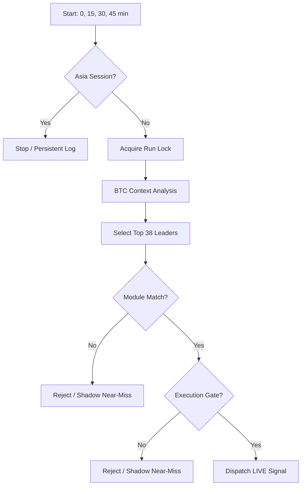

# 🦅 Documentación del Algoritmo de Trading (v10.1.0 QuantumEdge)

Esta documentación sirve como guía técnica para entender, mantener y optimizar el sistema de señales de trading de contado (Spot-Only) alojado en Netlify Functions.

> ⚠️ **Regla de mantenimiento:** Cualquier cambio en `trader-bot.js` debe reflejarse en este documento Y en `ALGORITHM_JOURNAL.md` antes de considerarse completo.

> ℹ️ **Nota de la V10:** Desde `v10.0.0-QuantumEdge`, hemos abandonado el "score soup" (mezcla de indicadores para un puntaje arbitrario) a favor de un sistema de **Módulos de Estrategia Puros**. Un trade solo existe si cumple los requisitos deterministas de un módulo institucional.

---

## Current Runtime Snapshot (v10.1.0)

### Resumen
- **Runtime Version:** `v10.1.0-QuantumEdge`
- **File Core:** `trader-bot.js` (anteriormente `scheduled-analysis.js`)
- **Estilo:** `spot`, `long-only`, intradía/day trading
- **Filosofía:** "Pure Edge Over Score Soup". Se eliminan las penalizaciones progresivas. Los requisitos son puertas binarias (Booleans) duras.
- **Ajuste principal:** Implementación de los módulos `VCP_BREAKOUT` y `VWAP_PULLBACK`.

### Arquitectura de Módulos Activa
- **`VCP_BREAKOUT` (Volatility Contraction Pattern)**
  - **Origen:** Mark Minervini / Conceptos Institucionales.
  - **Lógica:** Busca una contracción de volatilidad extrema (BB Width en el percentil inferior 15%) seguida de una expansión explosiva.
  - **Gates Duros:** Volume Ratio > 2.3x, OBI > 0.05 (Bid support), RS vs BTC positiva.
- **`VWAP_PULLBACK` (Institutional Reclaim)**
  - **Lógica:** Defensa del VWAP intradía en activos con fuerte tendencia y fortaleza relativa (RS).
  - **Gates Duros:** Cierre por encima de VWAP, mechas de rechazo inferiores (reclaim), RS positiva fuerte.

### Clasificación de Riesgo & Regímenes
- **`RISK_OFF`:** Bloqueo total si `BTC 4H` está bajista o BTC Status es `RED`.
- **`TRANSITION / RANGING`:** Operativos pero con score mínimo (Suelo) más elevado.
- **BTC Context (SEM):**
  - `RED`: Bloqueo total (Shadow Only).
  - `AMBER`: Requiere +4/+2 puntos extra de Score para entrar live.
  - `GREEN`: Operación normal.

### Filtros de Liquidez (v10.1.0 Update)
- `ELITE` / `HIGH` → Live ✅
- `MEDIUM` + `VWAP_PULLBACK` → Live ✅ (score floor +3)
- `MEDIUM` + `VCP_BREAKOUT` → Shadow Only
- `LOW` + `depthQuoteTopN >= $200k` + `VWAP_PULLBACK` → Live ✅ (0.5x sizing, `promotedFromLow` flag)
- `LOW` (below depth floor) → Shadow / Reject

---

## 1. Arquitectura del Sistema

El bot opera como un ecosistema serverless interconectado:

- **Netlify Functions:**
  - `trader-bot`: Ejecuta el análisis automático en las marcas `0,15,30,45` de cada hora.
  - `auto-digest`: Genera el reporte diario a las **09:00 UTC**.
  - `telegram-bot`: Interfaz de comandos.
- **Netlify Blobs**: Persistencia de `history.json`, `shadow_trades.json`, `persistent_logs.json`, etc.

---

## 2. Sistema de Decisión (Quantum Edition)

A diferencia de versiones anteriores, el Score ya no decide **SI** entramos, sino **CUÁNTO** apostamos.

1. **Validación de Módulo:** ¿Cumple el asset los requisitos del `VCP_BREAKOUT`? (Si/No).
2. **Ranking:** Si varios módulos son válidos, se elige el de mayor Score.
3. **Execution Gate:** Spread < 8bps y profundidad suficiente.
4. **Position Sizing:** El Score final escalado entre 0-100 determina el `recommendedSize` (0.5% a 3.5%).

---

## 3. Pipeline de Ejecución (trader-bot.js)

---

## 4. Gestión de Riesgo Adaptativa

| Módulo | SL Base | TP Base | Ratio R:R |
|--------|---------|---------|-----------|
| `VCP_BREAKOUT` | 1.8x ATR | 4.0x ATR | 2.22:1 |
| `VWAP_PULLBACK` | 2.0x ATR | 3.5x ATR | 1.75:1 |

- **Time Stop:** Cada módulo define sus horas de espera (Stale Exit) antes de cerrar un trade que no se mueve.
- **ATR Dynamic:** Si el ATR % es muy alto (>2.5%), el tamaño de posición se reduce un 35% automáticamente.

---

## 5. Changelog Reciente

### v10.1.0-QuantumEdge (14 Abr 2026)
- **Depth-Floor Promotion:** Candidatos `VWAP_PULLBACK` con `liquidityTier=LOW` pero `depthQuoteTopN >= $200k` ahora pueden operar live con sizing reducido al 50%. Se trackean con flag `promotedFromLow`.
- **MEDIUM-Tier Live para VWAP_PULLBACK:** `MEDIUM` ya no es shadow-only para `VWAP_PULLBACK`. Score floor +3 se mantiene como penalización.
- **VWAP_TOO_FAR Regime-Aware:** El techo de distancia al VWAP se amplía de 1.5% a 2.0% exclusivamente en régimen `TRENDING` confirmado. Non-TRENDING mantiene 1.5%.
- **Throughput:** Nuevo stage counter `PROMOTED_LOW` en logs `[THROUGHPUT]`.
- **Evidencia:** Basado en auditoría de 125 runs / 33 shadow trades resueltos. Los 7 shadow wins estaban en VWAP_PULLBACK (WR 33.3% en LOW con depth > $200k vs 0% en thin coins < $36k).

### v10.0.0-QuantumEdge (14 Abr 2026)
- **Rename:** `scheduled-analysis.js` → `trader-bot.js`.
- **Scheduler Fix:** Cambio de cron a `0,15,30,45 * * * *` para forzar registro en infraestructura Netlify.
- **Modernization:** Eliminación definitiva de heurísticas legacy de v9. Pasa a sistema de módulos puros `VCP` y `VWAP`.
- **Regime Gate:** Endurecimiento del filtro `BTC_RED_BLOCK`.

---

**Documentación actualizada v10.1.0 — 14 Abril 2026**
