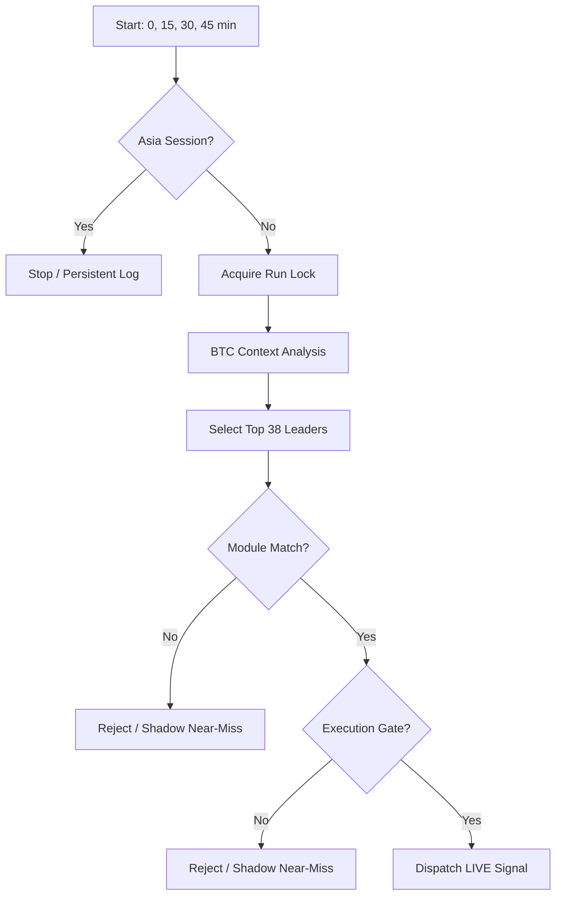

# 🦅 Documentación del Algoritmo de Trading (v11.1.1 / v2.1.1)

Esta documentación sirve como guía técnica para entender, mantener y optimizar el sistema de señales de trading de contado (Spot-Only) alojado en Netlify Functions.

> ⚠️ **Regla de mantenimiento:** Cualquier cambio en `trader-bot.js` debe reflejarse en este documento Y en `ALGORITHM_JOURNAL.md` antes de considerarse completo.

> ℹ️ **Nota de la V10:** Desde `v10.0.0-QuantumEdge`, hemos abandonado el "score soup" (mezcla de indicadores para un puntaje arbitrario) a favor de un sistema de **Módulos de Estrategia Puros**. Un trade solo existe si cumple los requisitos deterministas de un módulo institucional.

---

## Current Runtime Snapshot (v11.1.1)

### Resumen
- **Runtime Version:** `v11.1.1-QuantumEdge` / `v2.1.1-KnifeCatcher-Quantum`
- **File Core:** `trader-bot.js` y `knife-catcher.js`
- **Estilo Bot 1 (QuantumEdge):** `spot`, `long-only`, Momentum / Trend following (`trader-bot.js`).
- **Estilo Bot 2 (Knife Catcher):** `spot`, `long-only`, multi-strategy Mean Reversion / Reversal (`knife-catcher.js`).
- **Filosofía:** Módulos deterministas puros con bases de datos (Netlify Blobs) totalmente aisladas. Precision de 5m para reversiones.

### Arquitectura de Módulos Activa

#### Bot 1: QuantumEdge (`trader-bot.js`)
- **`VCP_BREAKOUT` (Volatility Contraction Pattern)**
  - **Origen:** Mark Minervini / Conceptos Institucionales.
  - **Lógica:** Busca una contracción de volatilidad extrema (BB Width en el percentil inferior 15%) seguida de una expansión explosiva.
  - **Gates Duros:** Volume Ratio > 2.3x, OBI > 0.05 (Bid support), RS vs BTC positiva. **Desde v11.0.0:** ADX > 14 obligatorio para base pre-breakout y filtro Multi-Candle Delta > 0.05 forzando compra taker agresiva en la expansión.
- **`VWAP_PULLBACK` (Institutional Reclaim)**
  - **Lógica:** Defensa del VWAP intradía en activos con fuerte tendencia y fortaleza relativa (RS).
  - **Gates Duros:** Cierre por encima de VWAP, mechas de rechazo inferiores (reclaim), RS positiva fuerte. **Desde v10.2.0:** RSI15m >= 45 y RS1H >= 0 para evitar *falling knifes* sin soporte de corto plazo. **Desde v11.0.0:** Anchor de 24h (96x15m). Rechazos duros si EMA 1H declina, si ADX < 16 (falta de tendencia), o si RSI > 72 (sobrecompra). Bonificaciones por Multi-Candle Delta fuerte.

#### Bot 2: Knife Catcher (`knife-catcher.js`)
- **`KNIFE_CATCHER` (Flash Crash Reversion)**
- **`STREAK_REVERSAL` (Streak Exhaustion)**
  - **Lógica:** Caza de rebotes tras $\ge$ 5 velas de 5m rojas consecutivas.
  - **Gates:** Streak $\le$ -5, **Volume Ratio >= 0.8x (hard gate desde v2.1.0)**. Rechaza con `STREAK_LOW_VOL` si volumen insuficiente.
- **`PIVOT_REVERSION` (Pivot Mean Reversion)**
  - **Lógica:** Retorno al punto pivote de 4H cuando el precio se desvía agresivamente a la baja.
  - **Gates:** Precio por debajo del Punto Pivote (48 bars lookback @ 5m).
- **`KELTNER_REVERSION` (Channel Fade)**
  - **Lógica:** Fade de la banda inferior de Keltner (1.5 ATR / EMA 20).
  - **Gates:** Cierre por debajo de la banda inferior en 5m.

### Clasificación de Riesgo & Regímenes
- **`RISK_OFF`:** Bloqueo total si `BTC 4H` está bajista o BTC Status es `RED`.
- **`TRANSITION / RANGING`:** Operativos pero con score mínimo (Suelo) más elevado.
- **BTC Context (SEM):**
  - `RED`: Bloqueo total (Shadow Only).
  - `AMBER`: Requiere +4/+2 puntos extra de Score para entrar live.
  - `GREEN`: Operación normal.
- **Penalización de Régimen (Bot 2, v2.1.1):**
  - `TRENDING`: `STREAK_REVERSAL`, `PIVOT_REVERSION` y `KELTNER_REVERSION` requieren `+5` puntos extra en el score mínimo.
  - `HIGH_VOL_BREAKOUT`: esos mismos módulos requieren otros `+5` puntos extra, porque el audit live mostró expectativa negativa en expansión de volatilidad.

### Filtros de Liquidez (v10.1.0 Update)
- `ELITE` / `HIGH` → Live ✅
- `MEDIUM` + `VWAP_PULLBACK` → Live ✅ (score floor +3)
- `MEDIUM` + `VCP_BREAKOUT` → Shadow Only
- `LOW` + `depthQuoteTopN >= $200k` + `VWAP_PULLBACK` → Live ✅ (0.5x sizing, `promotedFromLow` flag)
- `LOW` (below depth floor) → Shadow / Reject

---

## 1. Arquitectura del Sistema

El bot opera como un ecosistema serverless interconectado:

- **Netlify Functions Paralelas:**
  - `trader-bot`: Bot 1 (QuantumEdge). Corre en los minutos `0,15,30,45`.
  - `knife-catcher`: Bot 2 (Mean Reversion). Corre en los minutos `5,20,35,50` para evitar rate-limits de MEXC.
  - `auto-digest`: Genera el reporte diario a las **09:00 UTC**.
  - `telegram-bot`: Interfaz de comandos.
- **Netlify Blobs (Aislados):**
  - **Bot 1:** Usa llaves como `signal-history-v2`, `shadow-trades-v1`.
  - **Bot 2:** Usa llaves específicas como `knife-history-v1`, `knife-shadow-trades-v1`.

---

## 2. Sistema de Decisión (Quantum Edition)

A diferencia de versiones anteriores, el Score ya no decide **SI** entramos, sino **CUÁNTO** apostamos.

1. **Validación de Módulo:** ¿Cumple el asset los requisitos del `VCP_BREAKOUT`? (Si/No).
2. **Ranking:** Si varios módulos son válidos, se elige el de mayor Score.
3. **Execution Gate:** Spread < 8bps y profundidad suficiente.
4. **Position Sizing:** El Score final escalado entre 0-100 determina el `recommendedSize` (0.5% a 3.5%).

---

## 3. Pipeline de Ejecución (trader-bot.js)

---

## 4. Gestión de Riesgo Adaptativa

| Módulo | SL Base | TP Base | Ratio R:R |
|--------|---------|---------|-----------|
| `VCP_BREAKOUT` (Bot 1) | 1.8x ATR | 4.0x ATR | 2.22:1 |
| `VWAP_PULLBACK` (Bot 1) | 2.0x ATR | 3.5x ATR | 1.75:1 |
| `KNIFE_CATCHER` (Bot 2) | 1.0x ATR | 3.5x ATR | 3.50:1 |
| `STREAK_REVERSAL` (Bot 2)| ~1.2% Fixed| ~3.0% Fixed| 2.50:1 | 
| `PIVOT_REVERSION` (Bot 2)| ~1.0% Fixed| ~3.0% Fixed| 3.00:1 | 
| `KELTNER_REVERSION` (Bot 2)| 1.4x ATR | 3.2x ATR | 2.28:1 | 

- **Time Stop:** Cada módulo define sus horas de espera. `KNIFE_CATCHER` cierra a las 4h si no rebota, mientras que Bot 1 espera entre 6h y 12h. En v11.0.0, `HIGH_VOL_BREAKOUT` usa un time stop más apretado (reducido en 2h).
- **ATR Dynamic:** Si el ATR % es muy alto (>2.5%), el tamaño de posición se reduce un 35% automáticamente. Los tokens con liquidez `ELITE` relajan este límite en un 20% (v11).
- **Break-Even Stop (Añadido en v11.0.0):** Cuando un trade en Bot 1 alcanza el 50% de la distancia hacia su Take Profit, el Stop Loss se mueve automáticamente a Break-Even + 0.1%.
- **Regime Stops:** En transición (`TRANSITION`), el Stop Loss se aprieta al 0.9x del multiplicador base.

---

## 5. Changelog Reciente

### v2.1.0-KnifeCatcher-Quantum (21 Abr 2026)
- **[H1] STREAK Volume Hard Gate:** `STREAK_REVERSAL` ahora requiere `volumeRatio >= 0.8x` como gate duro. Rechaza con `STREAK_LOW_VOL`. Auditoría reveló que 3/4 losses de STREAK tenían volumePass=false (ratios 0.33x–0.72x).
- **[H2] TRENDING Regime Penalty:** Módulos de mean reversion (`STREAK`, `PIVOT`, `KELTNER`) requieren +5 puntos extra en régimen `TRENDING`. Auditoría mostró WR TRENDING=33.3% vs TRANSITION=73.3%.
- **Evidencia:** Basado en auditoría de 24 trades live (13W/9L, WR=59.1%). KELTNER destacó con +1.19R de expectativa (n=12). STREAK marginal a +0.03R (n=6).

### v2.1.1-KnifeCatcher-Quantum (24 Abr 2026)
- **[H4] HIGH_VOL_BREAKOUT Regime Penalty:** `STREAK_REVERSAL`, `PIVOT_REVERSION` y `KELTNER_REVERSION` requieren `+5` puntos extra en `HIGH_VOL_BREAKOUT`. Auditoría live del 21-23 Abr mostró `-0.18R` de expectativa en ese régimen frente a `+1.05R` en `TRANSITION`.
- **Telemetry Alignment:** `[THROUGHPUT] LIVE_SIGNAL` ahora cuenta solo señales realmente aceptadas y persistidas, no candidatos pre-sector.

### v11.1.1-QuantumEdge (24 Abr 2026)
- **Telemetry Alignment:** `[THROUGHPUT] LIVE_SIGNAL` pasa a registrarse después del filtro `SECTOR_CORRELATION` y antes de `recordSignalHistory()`, alineando la métrica con la realidad operativa.

### v11.1.0-QuantumEdge (21 Abr 2026)
- **[H3] MultiDelta Pipeline Diagnostics:** Logging diagnóstico para identificar por qué `multiDelta` devuelve `null` en todos los trades. Auditoría confirmó que los 7 autopsies y 6 shadows tienen `multiDelta: null`, anulando la protección anti-falling-knife.

### v2.0.0-KnifeCatcher-Quantum (19 Abr 2026)
- **5m Data Precision:** Incorporación de velas de 5 minutos al pipeline de análisis para señales de reversión táctica.
- **Multi-Strategy Reversion:** Despliegue de los módulos `STREAK_REVERSAL`, `PIVOT_REVERSION` y `KELTNER_REVERSION`.
- **Threshold Calibration:** Reducción de la dependencia de gates ultra-duros (4.0x vol, 4% BB distance) para permitir mayor operatividad en mercados de volatilidad normal.
- **Async Logic Optimization:** Paralelización de llamadas `getKlines` para 5m/15m/1h/4h minimizando el tiempo de ejecución.

### v11.0.0-QuantumEdge (17 Abr 2026)
- **Multi-Candle Delta:** Cuantificación del volumen *taker* continuo en las últimas 3 velas. Elimina rebotes y expansiones que no estén forzados por compras de mercado agresivas.
- **Signal Momentum Memory:** Ajustes automáticos de score basados en el rendimiento reciente del token (+3 pts para constante fuerza; -3 para debilidad frecuente).
- **VWAP Tuning:** El periodo base cambió de 50 barras a 96 barras (24h rodantes en 15m) mejorando la absorción institucional de sesión completa.
- **Break-Even System:** Asegura ganancias en señales que avanzan hasta +50% del TP moviendo automáticamente el `SL = entry + 0.1%`.
- **Sector Rotation Bonus:** +0.8 en score de oportunidad para activos `isCoreLeader` (BTC, ETH, SOL) reflejando alfa sectorial.

### v10.2.0-QuantumEdge (16 Abr 2026)
- **Zero MFE Protection:** Añadido `VWAP_FALLING_KNIFE` (RSI15m < 45) y `VWAP_WEAK_MOMENTUM` (RS1H < 0) en `VWAP_PULLBACK` para prevenir compras directas en caída sin soporte estructural.
- **Fakeout Protection:** Añadido `VCP_WEAK_MOMENTUM` (RS1H < 0) en `VCP_BREAKOUT` para asegurar outperform contra BTC.
- **Evidencia:** Auditoría reveló una severa fuga de capital en `VWAP_PULLBACK` con 10 pérdidas promediando `0.00%` MFE (cero favorabilidad) indicando ausencia de rebote.

### Multi-Bot Architecture (15 Abr 2026)
- **Implementación Paralela:** Creación de `knife-catcher.js` como segunda Netlify Function paralela.
- **Descorrelación:** El nuevo bot busca operaciones de "Deep Value / Flash Crash" exclusivas, completamente opuestas a los breakouts/pullbacks del Bot 1.
- **Offsets de Schedule:** Ejecución separada 5 minutos (`trader-bot` en 0,15; `knife-catcher` en 5,20) para distribuir la carga de API hacia MEXC HTTPS endpoints.
- **Storage Aislado:** Mapeo de bases de datos independientes en Netlify Blobs (`knife-*`) sincronizables vía CLI.

### v10.1.0-QuantumEdge (14 Abr 2026)
- **Depth-Floor Promotion:** Candidatos `VWAP_PULLBACK` con `liquidityTier=LOW` pero `depthQuoteTopN >= $200k` ahora pueden operar live con sizing reducido al 50%. Se trackean con flag `promotedFromLow`.
- **MEDIUM-Tier Live para VWAP_PULLBACK:** `MEDIUM` ya no es shadow-only para `VWAP_PULLBACK`. Score floor +3 se mantiene como penalización.
- **VWAP_TOO_FAR Regime-Aware:** El techo de distancia al VWAP se amplía de 1.5% a 2.0% exclusivamente en régimen `TRENDING` confirmado. Non-TRENDING mantiene 1.5%.
- **Throughput:** Nuevo stage counter `PROMOTED_LOW` en logs `[THROUGHPUT]`.
- **Evidencia:** Basado en auditoría de 125 runs / 33 shadow trades resueltos. Los 7 shadow wins estaban en VWAP_PULLBACK (WR 33.3% en LOW con depth > $200k vs 0% en thin coins < $36k).

### v10.0.0-QuantumEdge (14 Abr 2026)
- **Rename:** `scheduled-analysis.js` → `trader-bot.js`.
- **Scheduler Fix:** Cambio de cron a `0,15,30,45 * * * *` para forzar registro en infraestructura Netlify.
- **Modernization:** Eliminación definitiva de heurísticas legacy de v9. Pasa a sistema de módulos puros `VCP` y `VWAP`.
- **Regime Gate:** Endurecimiento del filtro `BTC_RED_BLOCK`.

---

**Documentación actualizada v11.1.1 / v2.1.1 — 24 Abril 2026**
